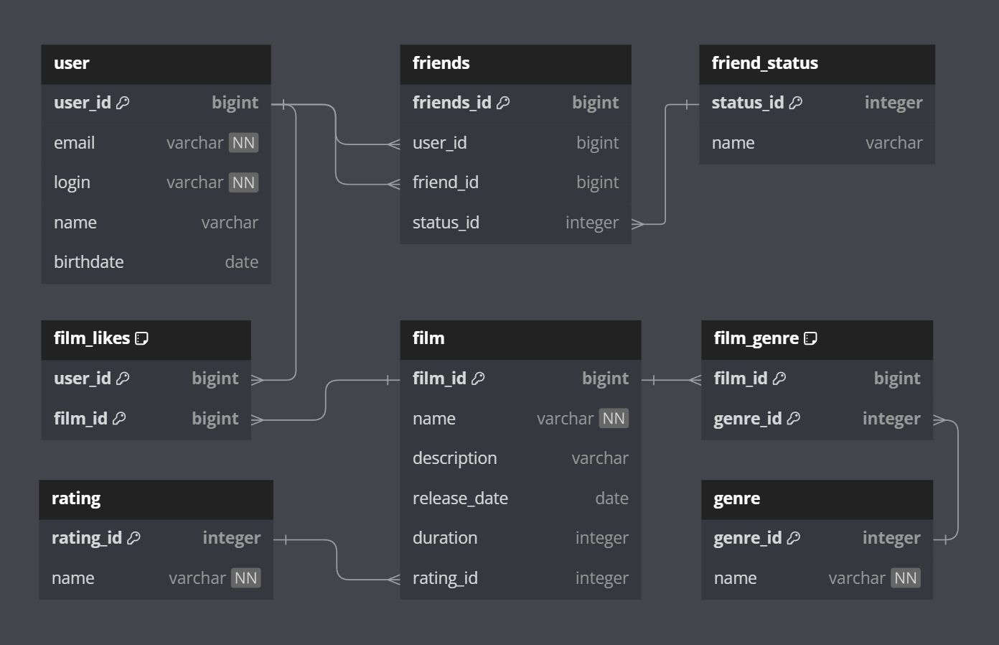

# java-filmorate
Simple REST application, written on Java using Spring Boot.
Allows the user to add, retrieve and delete users and films from database using POST, PUT, GET and DELETE requests.

## Database structure



## Examples of SQL queries
Get all users:
```
SELECT *
FROM user;
```
Get user by `id == 1`:
```
SELECT *
FROM user
WHERE user_id=1;
```
Get all friends of user with `id == 1`:
```
SELECT user_id,
       email,
       login,
       name,
       birthdate
FROM user
WHERE user_id IN
    (SELECT friend_id
     FROM friends
     WHERE user_id = 1);
```
Get all films:
```
SELECT *
FROM film;
```
Get film by `id == 1`:
```
SELECT *
FROM film
WHERE film_id=1;
```
Get 10 most popular films:
```
SELECT f.film_id,
       f.name,
       f.description,
       f.release_date,
       f.duration,
       r.name
FROM film AS f
LEFT JOIN rating AS r ON f.rating_id = r.rating_id
LEFT JOIN film_likes AS l ON f.film_id = l.film_id
GROUP BY f.film_id
ORDER BY count(l.user_id) DESC
LIMIT 10;
```